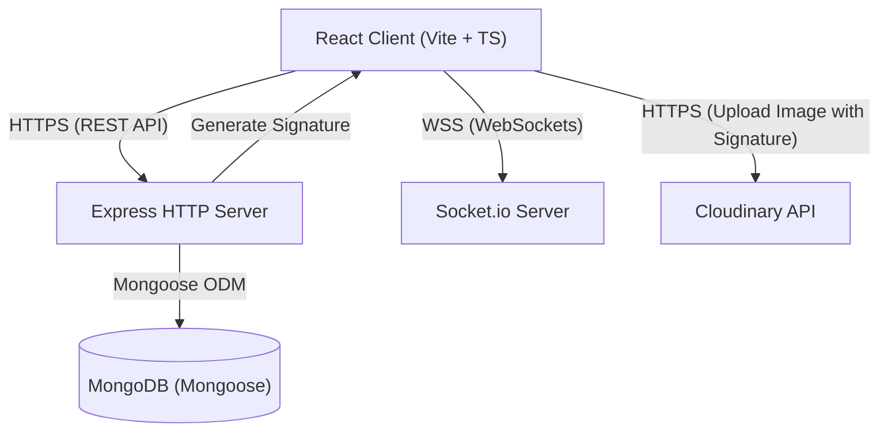
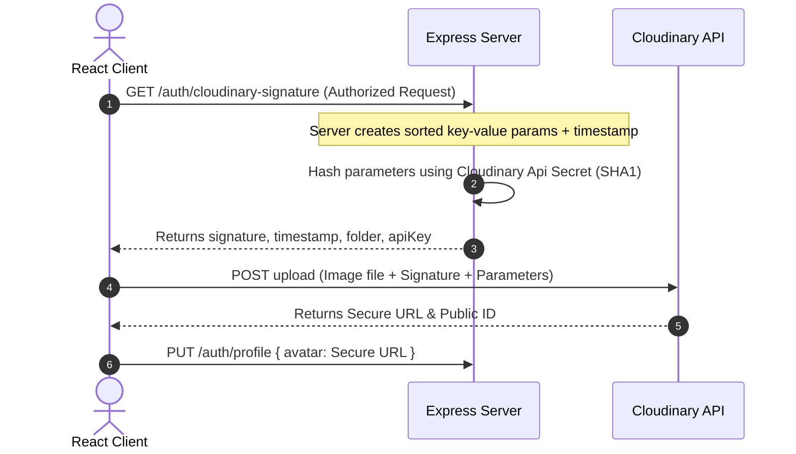

# IntellMeet System Design & Architecture

IntellMeet is a real-time collaboration and intelligent meeting platform. This document outlines the system architecture, component breakdown, data flow, and security implementations of both the frontend client and the backend server.

---

## 1. High-Level Architecture Diagram

The application is built on a decoupled Client-Server architecture utilizing a REST API for standard requests, WebSockets for bi-directional real-time communication, MongoDB for state persistence, and Cloudinary for media uploads.



---

## 2. Technology Stack

### Frontend Client
| Layer | Technology | Purpose |
| :--- | :--- | :--- |
| **Core Framework** | [React 19](file:///c:/Web%20Programmes/IntellMeet/client/package.json) | UI rendering and component architecture |
| **Build & Tooling** | [Vite 8](file:///c:/Web%20Programmes/IntellMeet/client/package.json) + TypeScript | Fast bundle times and static typing |
| **Styling** | TailwindCSS v4 | Modern utility-first CSS styling |
| **State Management** | Zustand | Lightweight client-side store (Auth and UI state) |
| **Routing** | React Router v7 | Client-side page navigation and Route Guards |
| **Real-time Client** | Socket.io Client | Real-time WebSocket connection to server |
| **Validation** | Zod + React Hook Form | Schema-based form validation |

### Backend Server
| Layer | Technology | Purpose |
| :--- | :--- | :--- |
| **Runtime & Framework**| Node.js + Express 5 | Fast, minimalist web framework for APIs |
| **Real-time Server** | Socket.io | Bi-directional, real-time message routing |
| **Database** | MongoDB + Mongoose | NoSQL Document database with ODM schema modeling |
| **Security & Auth** | JWT, bcryptjs, Helmet | Token authentication, secure password storage, secure headers |
| **Media Handling** | Cloudinary SDK | Cloud storage and image transformations |

---

## 3. Directory Layout & Key Entry Points

* **[/client](file:///c:/Web%20Programmes/IntellMeet/client)**: Frontend application.
  * **[client/src/App.tsx](file:///c:/Web%20Programmes/IntellMeet/client/src/App.tsx)**: Client routes, Socket connection setup, and authentication guards.
  * **`client/src/store/`**: Global state management stores (Zustand).
  * **`client/src/AuthComponents/`**: Authentication forms and views.
  * **`client/src/DashboardComponents/`**: App dashboard, Layout frame, and profile customization components.
* **[/server](file:///c:/Web%20Programmes/IntellMeet/server)**: Backend server.
  * **[server/index.js](file:///c:/Web%20Programmes/IntellMeet/server/index.js)**: Server initialization, HTTP wrapper, Socket.io event loop setup, and middleware bindings.
  * **[server/routes/AuthRoutes.js](file:///c:/Web%20Programmes/IntellMeet/server/routes/AuthRoutes.js)**: REST controllers for SignUp, Login, Refresh, Logout, Cloudinary Signatures, and Profile Updates.
  * **[server/models/UserModel.js](file:///c:/Web%20Programmes/IntellMeet/server/models/UserModel.js)**: Mongoose MongoDB schema defining `User` details.
  * **[server/database/mongodb.js](file:///c:/Web%20Programmes/IntellMeet/server/database/mongodb.js)**: Database client initialization.

---

## 4. Key Data Flows

### A. Authentication & Session Lifespans
The system uses a **Dual-Token System (JWT)** to manage session states securely:

```mermaid
sequenceDiagram
    autonumber
    actor Client as React Client
    participant Server as Express Server
    database DB as MongoDB

    Client->>Server: POST /auth/login (credentials)
    Server->>DB: Query User by Email
    DB-->>Server: Return User Hash
    Server->>Server: Verify password with bcrypt
    Server->>Server: Generate short-lived Access Token (15m)
    Server->>Server: Generate long-lived Refresh Token (7d)
    Server->>Client: Send HTTP-Only Cookie (Refresh Token) & Response JSON (Access Token)
    Note over Client,Server: Client stores Access Token in memory (Zustand)
```

1. **Token Refreshing:** When the access token expires, the client calls `POST /auth/refresh` sending the HTTP-only cookie automatically. The server validates the refresh token, updates the database/cookie if necessary, and issues a new access token.
2. **Access Protection:** Paths like profile changes are gated behind the [authenticateToken](file:///c:/Web%20Programmes/IntellMeet/server/middleware/auth.js) middleware.

### B. Cloudinary Secure Media Uploads
To prevent exposing Cloudinary secret keys to the frontend, uploads are completed using **Secure Signatures**:



### C. Real-time Communication (WebSockets)
1. **Connection**: Handled during application boot in [client/src/App.tsx](file:///c:/Web%20Programmes/IntellMeet/client/src/App.tsx) by initiating the `io('http://localhost:3000')` client.
2. **Handlers**: 
   * The server listens to connection events and binds channel listeners.
   * Messages are sent via `socket.on('message', data)` and broadcasted back to other participants via `socket.broadcast.emit('message', data)` to ensure instant sync.

---

## 5. Security & Verification
* **Helmet Middleware**: Integrated in [server/index.js](file:///c:/Web%20Programmes/IntellMeet/server/index.js) to set crucial HTTP security headers.
* **CORS Settings**: Restricts origin requests strictly to the client’s Vite port (`http://localhost:5173`) with credentials authorization.
* **HttpOnly Refresh Cookies**: Safeguards refresh tokens from cross-site scripting (XSS) attacks by making them inaccessible to JavaScript.
* **Bcrypt Password Salting**: Salting and hashing passwords 10 times to secure them against brute-force database leaks.
