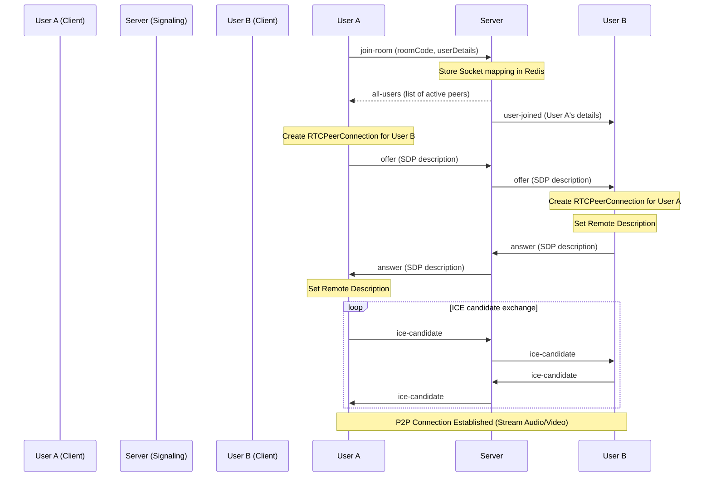

# IntellMeet Virtual Meeting Feature

The **Meeting Feature** is the core real-time collaborative workspace of the IntellMeet platform. It enables users to host and join instant or scheduled video calls, stream high-quality audio and video, share screens, and coordinate team actions dynamically.

---

## 🌟 Feature Overview & Core Capabilities

The meeting workspace comprises several key features:

1. **Instant / Scheduled Meetings**:
   - Create instant meetings from the dashboard or join scheduled calls.
   - Generate unique, secure, and Google-Meet-style room codes (e.g., `abc-defg-hij`).

2. **WebRTC Video and Audio Streaming**:
   - Establish low-latency peer-to-peer audio and video streams between participants.
   - Support for multiple active streams displayed in a dynamic grid layout.
   - Toggle camera (video feed) and microphone (audio feed) mute states in real-time.

3. **Screen Sharing**:
   - Stream browser tabs, application windows, or full monitors directly to peers using native browser media APIs.
   - Seamless media track swapping on the fly without interrupting call connections.

4. **Participant Directory**:
   - Interactive sidebar displaying the active roster of attendees currently present in the meeting.
   - Distinct labels identifying the room host and regular attendees.
   - Visual media state indicators (e.g., mic muted/unmuted icons).

5. **Security & Permissions**:
   - Support for private rooms where only authorized participants or invitees can access the call.
   - Room entry passcode protection options.

---

## 🛠️ Technological Stack & Libraries

The meeting module is built on a modern, decoupled architecture using the following technologies:

### 1. Client-Side (Frontend)
- **React**: Powers the reactive UI, managing states for peer lists, local streams, and control toggles.
- **WebRTC API (`RTCPeerConnection`, `MediaStream`)**: The native browser standard used to handle audio/video streaming, NAT traversal, and peer-to-peer data negotiation.
- **Socket.io Client (`socket.io-client`)**: Communicates with the backend signaling server to exchange room events, session descriptions (SDP), and ICE candidates.
- **Tailwind CSS / Vanilla CSS**: Used for rich styling, responsiveness, active participant grids, and smooth dashboard animations.

### 2. Server-Side (Backend)
- **Express (Node.js)**: Exposes REST APIs for room creation, authorization validation, metadata updates, and deletion.
- **Socket.io (`socket.io` server)**: Functions as the **Signaling Server** which facilitates WebRTC handshakes by bridging communication channels between remote clients before they establish direct connection.
- **MongoDB & Mongoose**: Stores persistent meeting records, including room status, titles, description, host, list of participants, and timestamps.
- **Redis (`redis` package)**:
  - **Metadata Cache**: Caches populated meeting documents to speed up join verification requests and prevent excessive database lookups.
  - **Socket Mapping Cache**: Caches active socket-to-room and socket-to-user maps in Redis Hashes (`socketToRoom` and `socketToUser`) to allow scale-ready signaling architectures.
  - **Graceful Fallback**: Automatically degrades to local in-memory fallback mappings if the Redis instance is unavailable.

---

## 🔄 How WebRTC Signaling Works in IntellMeet

Direct peer-to-peer communication requires coordination before a connection can be established. This is done via **signaling**:

